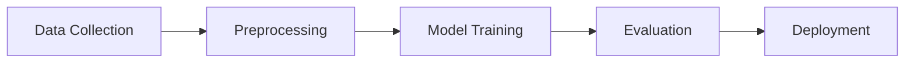

# Multi-Agent Course Creation Platform
## 6-Quarter Strategic Roadmap (2025-2026)

---

## Executive Summary

**Vision:** Transform course content creation from a 3-tool, 30-hour manual process into an AI-powered, multi-agent platform that delivers production-ready courses in under 2 hours.

**Current Pain Points:**
- Creating SCORM packages requires Articulate Storyline ($1,400/license)
- Visual creation requires Adobe Photoshop + design expertise
- Video editing requires Camtasia + video production skills
- Total time: 25-30 hours per course
- High dependency on specialized skills

**Solution:** Multi-agent AI platform where each agent handles one aspect of course creation, working independently or collaboratively.

**ROI:**
- Time savings: 60-70 hours per course (85% reduction)
- Cost savings: $3,200+ per course (tool licenses + labor)
- Quality: Consistent, professional output
- Scalability: Unlimited parallel course production

---

## Platform Architecture Overview

```
┌─────────────────────────────────────────────────────────────────┐
│              Course Creation Command Center                     │
│                     (Unified Dashboard)                         │
└─────────────────────────────────────────────────────────────────┘
                              ↓
┌─────────────────────────────────────────────────────────────────┐
│                    Orchestration Engine                         │
│  • Workflow Manager  • Agent Coordinator  • Quality Control     │
└─────────────────────────────────────────────────────────────────┘
                              ↓
┌──────────┬──────────┬──────────┬──────────┬──────────┬──────────┐
│ Agent 1  │ Agent 2  │ Agent 3  │ Agent 4  │ Agent 5  │ Agent 6  │
│  Video   │  Course  │  Visual  │Assessment│  SCORM   │Interactive│
│ Analyzer │Generator │ Creator  │ Builder  │ Packager │  Content │
│   (Q1)   │   (Q2)   │   (Q3)   │   (Q4)   │   (Q5)   │   (Q6)   │
└──────────┴──────────┴──────────┴──────────┴──────────┴──────────┘
                              ↓
┌─────────────────────────────────────────────────────────────────┐
│                      Shared Resources                           │
│  Database | File Storage | LLM API | Image Gen | TTS | Analytics│
└─────────────────────────────────────────────────────────────────┘
```

---

## Tech Stack (Platform-Wide)

### Backend
- **Framework:** FastAPI (Python 3.10+)
- **Database:** PostgreSQL (production), SQLAlchemy ORM
- **Task Queue:** Celery + Redis (background processing)
- **Storage:** AWS S3 / Local file system
- **AI/ML:** OpenAI API (GPT-4o, DALL-E 3, Whisper, TTS)

### Frontend
- **Core:** HTML5, CSS3, Vanilla JavaScript
- **UI Framework:** Tailwind CSS (optional: React for complex UIs)
- **Visualization:** D3.js, Chart.js
- **Video Player:** Video.js
- **Slide Rendering:** Reveal.js, Impress.js

### DevOps
- **Containerization:** Docker
- **CI/CD:** GitHub Actions
- **Monitoring:** Prometheus + Grafana
- **Logging:** ELK Stack (Elasticsearch, Logstash, Kibana)

---

# Quarter-by-Quarter Breakdown

---

## Q1 (COMPLETED) - Video Analyzer Agent 📹

**Status:** ✅ Base Complete | 🔄 Enhancement Phase

**Timeline:** 30-35 hours (enhancements only)

### Current Features
- Video upload with drag-and-drop
- Multi-language transcription (English, Japanese)
- AI-powered Q&A system
- Summary generation
- Audio summary with TTS
- Translation support

### Q1 Enhancements (NEW)
1. **Advanced Chapter Detection**
   - Auto-detect topic changes in transcript
   - Generate timestamps for each section
   - Create table of contents

2. **Key Concept Extraction**
   - Identify main topics, definitions, examples
   - Tag content by Bloom's taxonomy level
   - Extract action items from meetings

3. **Speaker Diarization**
   - Identify multiple speakers
   - Label "Speaker 1", "Speaker 2", etc.
   - Track who said what

4. **Visual Content Detection**
   - Detect when slides/presentations are shown
   - Extract on-screen text (OCR)
   - Capture key frames

### Technical Specifications

**New Endpoints:**
```python
POST /api/videos/analyze-chapters
  Input: video_id
  Output: {
    "chapters": [
      {
        "number": 1,
        "title": "Introduction",
        "start_time": "00:00",
        "end_time": "05:30",
        "key_points": [...],
        "transcript": "..."
      }
    ]
  }

POST /api/videos/extract-concepts
  Input: video_id, taxonomy_level
  Output: {
    "concepts": [
      {
        "term": "Machine Learning",
        "definition": "...",
        "examples": [...],
        "bloom_level": "understanding"
      }
    ]
  }
```

**New Database Fields:**
```sql
ALTER TABLE videos ADD COLUMN chapters JSON;
ALTER TABLE videos ADD COLUMN concepts JSON;
ALTER TABLE videos ADD COLUMN speakers JSON;
ALTER TABLE videos ADD COLUMN visual_content JSON;
```

### Demo for Manager
**Title:** "Smart Video Library with Searchable Knowledge Base"

**Script:**
1. Upload 1-hour training webinar
2. Show auto-generated chapters (8 sections)
3. Demonstrate speaker identification
4. Search for specific concept across transcript
5. Extract action items automatically

**Impact:** "Find any information in our 100+ training videos in seconds, not hours."

### Success Metrics
- Process 60-min video in under 5 minutes
- 95%+ transcription accuracy
- Chapter detection accuracy: 85%+
- Concept extraction: 20-30 concepts per hour of video

---

## Q2 - Course Structure Generator Agent 📚

**Timeline:** 35-40 hours

**Dependencies:** Q1 Video Analyzer output

### Features

#### 1. Intelligent Content Structuring (10-12h)
**What it does:**
- Analyzes video transcript or documents
- Generates course outline with 5-8 chapters
- Creates learning objectives per chapter
- Identifies prerequisites and next steps
- Maps to instructional design frameworks (ADDIE, Bloom's)

**Input Sources:**
- Video transcripts (from Agent 1)
- PDF documents
- Word documents
- PowerPoint presentations
- Text content

**Output:**
```json
{
  "course": {
    "title": "Introduction to Machine Learning",
    "duration": "4 hours",
    "difficulty": "intermediate",
    "prerequisites": ["Python basics", "Statistics fundamentals"],
    "learning_outcomes": [
      "Understand core ML concepts",
      "Build basic ML models",
      "Evaluate model performance"
    ],
    "chapters": [
      {
        "number": 1,
        "title": "What is Machine Learning?",
        "duration": "30 mins",
        "learning_objectives": [
          "Define machine learning",
          "Distinguish between supervised and unsupervised learning"
        ],
        "key_points": [
          "ML enables computers to learn from data",
          "Types: Supervised, Unsupervised, Reinforcement"
        ],
        "content": "Full chapter content...",
        "activities": ["Watch intro video", "Read case study"],
        "assessment_questions": 3
      }
    ]
  }
}
```

#### 2. Professional Slide Generation (12-15h)
**Technology:** Reveal.js (HTML-based presentations)

**Features:**
- Multiple professional themes (Dark, Light, Corporate, Academic)
- Responsive design (works on all devices)
- Auto-formatted bullet points
- Smart content distribution (not overcrowded)
- Speaker notes integration

**Slide Types:**
1. **Title Slide**
   - Course title
   - Generated date
   - Estimated duration
   - Language

2. **Table of Contents** (auto-generated)
   - All chapters with page numbers
   - Clickable navigation

3. **Learning Objectives Slide** (per chapter)
   - Bullet list of objectives
   - Estimated time

4. **Content Slides**
   - Max 5-7 bullet points per slide
   - Optional: sub-bullets
   - Speaker notes at bottom
   - Pagination

5. **Summary Slide** (per chapter)
   - Key takeaways
   - Transition to next chapter

6. **Final Summary**
   - Course recap
   - Next steps
   - Resources

**Template Structure:**
```html
<!DOCTYPE html>
<html>
<head>
  <link rel="stylesheet" href="reveal.js/dist/reveal.css">
  <link rel="stylesheet" href="reveal.js/dist/theme/custom.css">
</head>
<body>
  <div class="reveal">
    <div class="slides">
      <!-- Auto-generated slides -->
    </div>
  </div>
  <script src="reveal.js/dist/reveal.js"></script>
</body>
</html>
```

#### 3. Quiz Generation System (8-10h)

**Question Types:**
- Multiple Choice (4 options)
- True/False
- Fill in the blank
- Matching (terms to definitions)

**Difficulty Levels:**
- **Easy (40%):** Recall facts, definitions
- **Medium (40%):** Understanding, application
- **Hard (20%):** Analysis, evaluation

**Features:**
- 10-15 questions per course
- Distractors (wrong answers) generated intelligently
- Explanations for each answer
- Randomization support
- Score calculation
- Pass/fail threshold (default: 70%)

**Quiz Format:**
```json
{
  "quiz": {
    "title": "Machine Learning Fundamentals Quiz",
    "passing_score": 70,
    "time_limit": 20,
    "questions": [
      {
        "id": 1,
        "type": "mcq",
        "question": "What is supervised learning?",
        "options": [
          "Learning with labeled data",
          "Learning without any data",
          "Learning with unlabeled data",
          "Learning by trial and error"
        ],
        "correct_answer": 0,
        "explanation": "Supervised learning uses labeled training data...",
        "difficulty": "easy",
        "chapter": 1,
        "points": 1
      }
    ]
  }
}
```

**Interactive Quiz UI:**
- One question per page
- Progress indicator
- Immediate feedback (optional)
- Score summary at end
- Review incorrect answers
- Retake option

#### 4. Course Assembly & Viewer (5-6h)

**Features:**
- Full-screen presentation mode
- Navigation: Next, Previous, Jump to chapter
- Progress tracking (% complete)
- Keyboard shortcuts (arrow keys, ESC)
- Touch/swipe support for mobile
- Search within slides
- Print-friendly version
- Bookmark functionality

**Export Options:**
1. **HTML Package** (zip file)
   - Self-contained, no internet needed
   - Open in any browser
   - Includes all assets

2. **PDF Version**
   - One page per slide
   - Printer-friendly
   - Notes included (optional)

3. **Markdown Version**
   - Plain text format
   - Version control friendly
   - Easy editing

### Technical Implementation

**New Backend Files:**
```
backend/
├── course_structurer.py
│   ├── analyze_content()
│   ├── generate_outline()
│   ├── create_learning_objectives()
│   └── map_to_framework()
│
├── slide_generator.py
│   ├── create_slide_deck()
│   ├── apply_theme()
│   ├── format_content()
│   └── export_html()
│
├── quiz_generator.py
│   ├── generate_questions()
│   ├── create_distractors()
│   ├── validate_quality()
│   └── calculate_difficulty()
│
└── course_assembler.py
    ├── combine_components()
    ├── add_navigation()
    ├── create_viewer()
    └── export_package()
```

**New Frontend Files:**
```
frontend/
├── course-builder.html
├── course-builder.js
├── course-viewer.html
├── course-viewer.js
├── quiz-player.html
├── quiz-player.js
└── templates/
    ├── theme-dark.css
    ├── theme-light.css
    └── theme-corporate.css
```

**New API Endpoints:**
```python
# Course Structure
POST /api/course/analyze
  Input: {video_id OR document_file OR text_content}
  Output: {course_outline JSON}

POST /api/course/generate-slides
  Input: {course_outline, theme}
  Output: {slide_deck_html}

POST /api/course/generate-quiz
  Input: {course_outline, num_questions, difficulty}
  Output: {quiz JSON}

POST /api/course/assemble
  Input: {slides, quiz, metadata}
  Output: {course_package_id}

GET /api/course/{course_id}/export
  Query: ?format=html|pdf|markdown
  Output: Download link

# Course Management
GET /api/courses
  Output: List of all generated courses

GET /api/course/{course_id}
  Output: Course details and content

PUT /api/course/{course_id}
  Input: Updated course data
  Output: Success status

DELETE /api/course/{course_id}
  Output: Success status
```

**Database Schema:**
```sql
CREATE TABLE courses (
    id INTEGER PRIMARY KEY,
    title VARCHAR(255),
    description TEXT,
    video_id INTEGER REFERENCES videos(id),
    source_type VARCHAR(50), -- 'video', 'document', 'text'
    outline JSON,
    slides_html TEXT,
    quiz_data JSON,
    theme VARCHAR(50),
    created_at TIMESTAMP,
    updated_at TIMESTAMP,
    metadata JSON
);

CREATE TABLE course_chapters (
    id INTEGER PRIMARY KEY,
    course_id INTEGER REFERENCES courses(id),
    chapter_number INTEGER,
    title VARCHAR(255),
    content TEXT,
    learning_objectives JSON,
    duration_minutes INTEGER,
    slide_start INTEGER,
    slide_end INTEGER
);
```

### Development Timeline (Week-by-Week)

**Week 1 (12-15 hours)**
- Day 1-2: Course structuring logic
  - LLM prompts for content analysis
  - Outline generation algorithm
  - Learning objectives mapping
- Day 3: Testing with various content types
  - Video transcripts
  - PDF documents
  - Text content

**Week 2 (12-15 hours)**
- Day 4-5: Slide generation system
  - Reveal.js integration
  - Template creation (3 themes)
  - Content formatting logic
- Day 6: Slide rendering and preview

**Week 3 (11-13 hours)**
- Day 7: Quiz generation
  - Question generation prompts
  - Distractor creation
  - Difficulty calculation
- Day 8: Quiz UI and interaction
  - Question player
  - Score calculation
  - Results display
- Day 9: Course assembly and export
  - Package creation
  - Export to HTML/PDF
  - Final testing and polish

### Demo for Manager

**Title:** "From Video to Course in 5 Minutes"

**Live Demo Script (10 minutes):**

1. **Setup (1 min)**
   - "Last quarter we could transcribe and search videos"
   - "This quarter: full course creation automation"

2. **Upload & Process (2 min)**
   - Upload 45-minute training webinar
   - Show processing: "Analyzing content... Generating outline..."
   - Display generated outline (8 chapters)

3. **Review Course Structure (2 min)**
   - Show learning objectives per chapter
   - Navigate through auto-generated slides
   - Highlight professional formatting

4. **Quiz Preview (2 min)**
   - Show 12 auto-generated questions
   - Demonstrate interactive quiz player
   - Show scoring and feedback

5. **Export Options (1 min)**
   - Export as HTML package
   - Download and open in browser
   - Show it works offline

6. **Results (2 min)**
   - **Before:** 20-25 hours manual work
   - **After:** 5 mins processing + 1 hour review
   - **Savings:** 19 hours per course (95% reduction)

**Key Talking Points:**
- "Works with any training video or document"
- "Professional slides in corporate theme"
- "Quiz questions aligned with learning objectives"
- "Ready to share with learners immediately"

### Success Metrics

**Performance:**
- Generate course outline in < 60 seconds
- Create 30-slide deck in < 90 seconds
- Generate 15 quiz questions in < 45 seconds
- Total processing time: < 5 minutes for 1-hour video

**Quality:**
- Learning objectives align with content (95%+ accuracy)
- Quiz questions are relevant (90%+ pass user review)
- Slides are well-formatted (no manual fixes needed)
- Export success rate: 99%+

**Adoption:**
- 80% of learning team uses it monthly
- 50 courses generated in first quarter
- Average review time: < 2 hours per course
- NPS score: 8+/10

---

## Q3 - Visual Content Creator Agent 🎨

**Timeline:** 35-40 hours

**Dependencies:** Q2 course structure (optional: can work standalone)

### Features

#### 1. AI Image Generation (12-15h)
**Purpose:** Generate custom images for course concepts

**Capabilities:**
- Concept illustrations (e.g., "cloud computing architecture")
- Character/avatar creation for scenarios
- Background images for slides
- Icons and symbols
- Abstract visuals for complex topics

**Technology:**
- Primary: DALL-E 3 (OpenAI)
- Alternative: Stable Diffusion (local, cost-effective)
- Fallback: Unsplash API (stock photos)

**Features:**
- Multiple style options: Realistic, Illustration, Minimalist, 3D
- Consistent art style across course
- Auto-generation based on slide content
- Manual prompt editing support
- Image variations (generate 3, pick best)

**Workflow:**
```python
# For each slide with concept
slide_text = "Machine learning uses algorithms to learn patterns"
prompt = generate_image_prompt(slide_text, style="minimalist")
# Generated prompt: "Minimalist illustration of a computer
# analyzing data patterns, blue and white color scheme,
# flat design, simple shapes"

image = dalle.generate(prompt, size="1024x1024")
slide.add_image(image, position="right")
```

#### 2. Diagram & Flowchart Generator (10-12h)
**Purpose:** Auto-create technical diagrams

**Diagram Types:**
- Flowcharts (process flows, decision trees)
- Architecture diagrams (system design, network topology)
- Mind maps (concept relationships)
- Timelines (project schedules, historical events)
- Organization charts
- Venn diagrams
- Cycle diagrams

**Technology:**
- Mermaid.js (code-to-diagram)
- GraphViz (graph visualization)
- D3.js (custom interactive diagrams)
- PlantUML (UML diagrams)

**Example - Auto-generate from text:**
```
Input: "The ML pipeline has 5 steps: data collection,
preprocessing, model training, evaluation, and deployment"

Output: Flowchart showing 5 connected boxes
```

**Mermaid Code Generated:**


#### 3. Infographic Creator (8-10h)
**Purpose:** Visualize data and statistics

**Infographic Types:**
- Statistics panels (pie charts, bar graphs)
- Comparison tables
- Timeline infographics
- Process infographics (step 1, 2, 3...)
- Data visualizations
- Icon-based statistics

**Features:**
- Auto-detect numbers/stats in content
- Suggest visualization type
- Brand color scheme application
- Export as SVG (scalable) or PNG

**Example:**
```
Input: "70% of companies use AI, 30% are planning to adopt it"
Output: Donut chart with two segments + legend
```

#### 4. Brand Consistency Engine (5-6h)
**Purpose:** Maintain visual consistency

**Features:**
- Company logo placement
- Color scheme application (primary, secondary, accent)
- Font consistency
- Layout templates
- Spacing and alignment rules

**Configuration:**
```json
{
  "brand": {
    "logo": "company_logo.png",
    "colors": {
      "primary": "#0066CC",
      "secondary": "#00CC66",
      "accent": "#FF9900",
      "text": "#333333",
      "background": "#FFFFFF"
    },
    "fonts": {
      "heading": "Montserrat",
      "body": "Open Sans"
    },
    "style": "corporate"
  }
}
```

### Technical Implementation

**New Backend Files:**
```
backend/
├── visual_creator.py
│   ├── generate_image()
│   ├── create_diagram()
│   ├── generate_infographic()
│   └── apply_branding()
│
├── image_generator.py
│   ├── dalle_generate()
│   ├── stable_diffusion_generate()
│   ├── optimize_prompt()
│   └── post_process_image()
│
├── diagram_generator.py
│   ├── detect_diagram_type()
│   ├── generate_mermaid()
│   ├── render_diagram()
│   └── export_svg()
│
└── infographic_generator.py
    ├── extract_statistics()
    ├── suggest_chart_type()
    ├── generate_chart()
    └── create_infographic()
```

**New API Endpoints:**
```python
# Image Generation
POST /api/visuals/generate-image
  Input: {
    "description": "concept to visualize",
    "style": "realistic|illustration|minimalist",
    "size": "1024x1024|1792x1024"
  }
  Output: {image_url, thumbnail_url}

# Diagram Generation
POST /api/visuals/generate-diagram
  Input: {
    "text": "process description",
    "diagram_type": "flowchart|architecture|mindmap"
  }
  Output: {diagram_svg, mermaid_code}

# Infographic Generation
POST /api/visuals/generate-infographic
  Input: {
    "data": {"stat1": 70, "stat2": 30},
    "type": "pie|bar|timeline"
  }
  Output: {infographic_url}

# Batch Processing
POST /api/visuals/generate-for-course
  Input: {course_id}
  Output: {
    "visuals": [
      {slide_id: 1, visual_url: "...", type: "image"},
      {slide_id: 3, visual_url: "...", type: "diagram"}
    ]
  }

# Brand Management
POST /api/visuals/set-brand
  Input: {brand_config JSON}
  Output: {success}

GET /api/visuals/brand
  Output: {current brand settings}
```

**Database Schema:**
```sql
CREATE TABLE visuals (
    id INTEGER PRIMARY KEY,
    course_id INTEGER REFERENCES courses(id),
    slide_number INTEGER,
    visual_type VARCHAR(50), -- 'image', 'diagram', 'infographic'
    description TEXT,
    prompt TEXT, -- AI prompt used
    file_path VARCHAR(255),
    thumbnail_path VARCHAR(255),
    metadata JSON,
    created_at TIMESTAMP
);

CREATE TABLE brand_settings (
    id INTEGER PRIMARY KEY,
    organization_id INTEGER,
    logo_path VARCHAR(255),
    colors JSON,
    fonts JSON,
    style VARCHAR(50),
    created_at TIMESTAMP
);
```

### Development Timeline

**Week 1 (12-15 hours)**
- Day 1-2: Image generation integration
  - DALL-E 3 API setup
  - Prompt engineering system
  - Image storage and retrieval
- Day 3: Stable Diffusion alternative
  - Local generation setup
  - Quality comparison

**Week 2 (12-15 hours)**
- Day 4-5: Diagram generation
  - Mermaid.js integration
  - Text-to-diagram logic
  - SVG rendering
- Day 6: Infographic system
  - Data extraction
  - Chart generation
  - Template design

**Week 3 (11-13 hours)**
- Day 7: Brand consistency
  - Brand config system
  - Style application
  - Logo placement
- Day 8: Integration with Q2 course generator
  - Auto-visual assignment
  - Batch processing
- Day 9: UI and testing
  - Visual editor interface
  - Preview and regenerate
  - Final polish

### Demo for Manager

**Title:** "AI Designer: Professional Visuals Without Photoshop"

**Demo Script (10 minutes):**

1. **Problem Statement (1 min)**
   - "Creating course visuals requires designers"
   - "Each course needs 15-20 custom images"
   - "Current bottleneck: 6-8 hours per course"

2. **Automatic Visual Generation (3 min)**
   - Open course from Q2
   - Click "Generate Visuals"
   - Show AI analyzing each slide
   - Watch images generate in real-time
   - Display before/after slides

3. **Diagram Creation (2 min)**
   - Type: "Show the software development lifecycle"
   - Agent generates flowchart
   - Edit: "Make it circular"
   - Regenerates as cycle diagram

4. **Infographic Example (2 min)**
   - Input: "75% of learners prefer video, 25% prefer text"
   - Generate pie chart infographic
   - Show 3 style variations
   - Select and insert into slide

5. **Brand Consistency (1 min)**
   - Upload company logo
   - Set brand colors
   - Regenerate all visuals with branding
   - Show consistent theme across course

6. **Results (1 min)**
   - **Before:** 6-8 hours + designer cost
   - **After:** 10 minutes AI generation + 30 min review
   - **Quality:** Professional, consistent, on-brand

### Success Metrics

**Performance:**
- Generate image in < 30 seconds
- Create diagram in < 10 seconds
- Batch generate 20 visuals in < 8 minutes

**Quality:**
- 85%+ visuals accepted without regeneration
- Brand consistency score: 95%+
- User satisfaction: 8+/10

**Cost:**
- Image generation: $0.04 per image (DALL-E 3)
- 20 images per course: $0.80 per course
- vs. Designer cost: $200+ per course
- **ROI: 250x savings**

---

## Q4 - Assessment Builder Agent ✅

**Timeline:** 30-35 hours

**Dependencies:** Q2 course content

### Features

#### 1. Advanced Question Generation (10-12h)

**Question Types (Beyond Basic MCQ):**

**A. Scenario-Based Questions**
- Present realistic situation
- Ask for best course of action
- Multiple steps/dependencies

Example:
```
Scenario: A customer reports their account is locked after
3 failed login attempts. They need urgent access.

Question: What should you do first?
a) Reset their password immediately
b) Verify their identity through security questions
c) Escalate to manager
d) Tell them to wait 30 minutes

Correct: b
Explanation: Security protocols require identity verification
before any account changes...
```

**B. Drag-and-Drop Ordering**
- Order steps in correct sequence
- Arrange timeline of events
- Prioritize tasks

Example:
```
Arrange these software development phases in order:
☐ Testing
☐ Requirements Gathering
☐ Deployment
☐ Design
☐ Implementation

Correct order: 2, 4, 5, 1, 3
```

**C. Matching Questions**
- Connect terms to definitions
- Match problems to solutions
- Link causes to effects

Example:
```
Match each ML algorithm to its use case:

Algorithms:          Use Cases:
1. Linear Regression    A. Image classification
2. Decision Tree        B. Predicting house prices
3. Neural Network       C. Customer segmentation
4. K-Means             D. Email spam detection

Correct: 1-B, 2-D, 3-A, 4-C
```

**D. Fill-in-the-Blank (Cloze)**
- Complete sentences
- Code completion
- Formula completion

Example:
```
Machine learning is a subset of _____ that enables
computers to learn from _____ without being explicitly
programmed.

Answers: [artificial intelligence, data]
```

**E. Hotspot Questions (Image-based)**
- Click correct area on image
- Identify parts of diagram
- Select region on screenshot

**F. Essay/Short Answer**
- Open-ended responses
- Manual grading required
- AI-suggested grading rubric

#### 2. Intelligent Distractor Generation (4-5h)
**Purpose:** Create convincing wrong answers

**Techniques:**
- **Common Misconceptions:** Based on typical learner errors
- **Partial Truth:** Answers that are partially correct
- **Similar Terms:** Close but incorrect terminology
- **Opposite Concepts:** Contradictory options
- **Plausible but Wrong:** Logical-sounding but incorrect

**Algorithm:**
```python
def generate_distractors(correct_answer, context):
    """
    Generate 3 plausible wrong answers
    """
    distractors = []

    # Technique 1: Common misconception
    distractors.append(llm.generate(
        f"What is a common misconception about {context}?"
    ))

    # Technique 2: Partial truth
    distractors.append(llm.generate(
        f"Give a partially correct but incomplete answer for {context}"
    ))

    # Technique 3: Similar term
    distractors.append(get_similar_term(correct_answer))

    return distractors
```

#### 3. Adaptive Difficulty System (5-6h)

**Bloom's Taxonomy Integration:**
- **Remember (Easy):** Recall facts, terms, concepts
- **Understand (Medium):** Explain ideas, summarize
- **Apply (Medium-Hard):** Use knowledge in new situations
- **Analyze (Hard):** Break down information, find patterns
- **Evaluate (Hard):** Make judgments, critique
- **Create (Very Hard):** Combine elements, design solutions

**Dynamic Difficulty:**
```python
class AdaptiveQuiz:
    def __init__(self, questions):
        self.questions = sorted_by_difficulty(questions)
        self.difficulty_level = "medium"

    def get_next_question(self, previous_correct):
        """Adjust difficulty based on performance"""
        if previous_correct:
            self.difficulty_level = increase_difficulty()
        else:
            self.difficulty_level = decrease_difficulty()

        return self.questions[self.difficulty_level].pop()
```

**Features:**
- Start at medium difficulty
- Increase difficulty after 2 consecutive correct answers
- Decrease after 2 consecutive wrong answers
- Track individual learner progress
- Personalized question selection

#### 4. Question Bank Management (4-5h)

**Features:**
- Store all generated questions
- Tag by topic, difficulty, question type
- Version control (track changes)
- Search and filter
- Reuse across courses
- Analytics (which questions are too easy/hard)

**Database Schema:**
```sql
CREATE TABLE question_bank (
    id INTEGER PRIMARY KEY,
    course_id INTEGER,
    chapter_id INTEGER,
    question_text TEXT,
    question_type VARCHAR(50),
    difficulty VARCHAR(20), -- easy, medium, hard
    bloom_level VARCHAR(50),
    options JSON, -- for MCQ
    correct_answer TEXT,
    explanation TEXT,
    tags JSON,
    times_used INTEGER DEFAULT 0,
    times_correct INTEGER DEFAULT 0,
    times_incorrect INTEGER DEFAULT 0,
    avg_time_seconds FLOAT,
    created_at TIMESTAMP,
    updated_at TIMESTAMP
);
```

#### 5. Assignment & Rubric Generator (5-6h)

**Assignment Types:**
- Written reports
- Case study analysis
- Project submissions
- Presentations
- Portfolio items

**Rubric Generator:**
```json
{
  "assignment": "Build a simple ML classification model",
  "rubric": {
    "criteria": [
      {
        "name": "Data Preprocessing",
        "weight": 20,
        "levels": [
          {
            "score": 5,
            "description": "Excellent: Complete preprocessing with documentation"
          },
          {
            "score": 3,
            "description": "Adequate: Basic preprocessing applied"
          },
          {
            "score": 1,
            "description": "Needs Improvement: Minimal preprocessing"
          }
        ]
      },
      {
        "name": "Model Implementation",
        "weight": 40,
        "levels": [...]
      }
    ],
    "total_points": 100
  }
}
```

#### 6. Auto-Grading System (Basic) (3-4h)

**Auto-Gradable:**
- MCQ, True/False: Instant grading
- Fill-in-blank: Exact match or fuzzy match
- Numeric answers: Accept range
- Code submission: Run test cases (basic)

**Manual Grading:**
- Essay questions: AI-suggested scores + human review
- Projects: Rubric-guided assessment
- Presentations: Checklist evaluation

### Technical Implementation

**New Backend Files:**
```
backend/
├── assessment_builder.py
│   ├── generate_questions()
│   ├── generate_scenario()
│   ├── create_adaptive_quiz()
│   └── generate_assignment()
│
├── question_generator.py
│   ├── generate_mcq()
│   ├── generate_scenario()
│   ├── generate_matching()
│   ├── generate_ordering()
│   └── generate_fillblank()
│
├── distractor_engine.py
│   ├── generate_distractors()
│   ├── validate_distractor()
│   └── ensure_uniqueness()
│
├── question_bank.py
│   ├── save_question()
│   ├── search_questions()
│   ├── get_by_difficulty()
│   └── get_analytics()
│
├── rubric_generator.py
│   ├── generate_rubric()
│   ├── suggest_criteria()
│   └── calculate_weighted_score()
│
└── grading_engine.py
    ├── auto_grade()
    ├── suggest_score()
    └── calculate_final_grade()
```

**New API Endpoints:**
```python
# Question Generation
POST /api/assessment/generate-questions
  Input: {
    course_id,
    num_questions,
    difficulty_mix: {easy: 30, medium: 50, hard: 20},
    question_types: ["mcq", "scenario", "matching"]
  }
  Output: {questions: [...]}

POST /api/assessment/generate-scenario
  Input: {topic, difficulty, context}
  Output: {scenario_question}

# Question Bank
GET /api/assessment/question-bank
  Query: ?tags=ML,python&difficulty=medium
  Output: {questions: [...]}

POST /api/assessment/question-bank
  Input: {question object}
  Output: {question_id}

# Adaptive Quiz
POST /api/assessment/create-adaptive-quiz
  Input: {course_id, starting_difficulty}
  Output: {quiz_id, first_question}

POST /api/assessment/submit-answer
  Input: {quiz_id, question_id, answer}
  Output: {correct, explanation, next_question}

# Assignments
POST /api/assessment/generate-assignment
  Input: {course_id, assignment_type}
  Output: {assignment, rubric}

# Grading
POST /api/assessment/grade
  Input: {submission, question_id}
  Output: {score, feedback}
```

### Development Timeline

**Week 1 (10-12 hours)**
- Day 1-2: Advanced question types
  - Scenario generation
  - Matching & ordering questions
  - Fill-in-blank
- Day 3: Distractor generation
  - Algorithm implementation
  - Quality validation

**Week 2 (10-12 hours)**
- Day 4: Adaptive difficulty system
  - Bloom's taxonomy mapping
  - Dynamic question selection
- Day 5: Question bank
  - Database schema
  - CRUD operations
  - Search & analytics
- Day 6: Assignment & rubric generator
  - Template creation
  - Rubric logic

**Week 3 (8-10 hours)**
- Day 7: Auto-grading system
  - MCQ/TF grading
  - Fuzzy matching
  - Score calculation
- Day 8: Integration & UI
  - Quiz player enhancements
  - Results dashboard
- Day 9: Testing & polish

### Demo for Manager

**Title:** "Intelligent Assessment Suite - Beyond Basic Quizzes"

**Demo Script (10 minutes):**

1. **Current State (1 min)**
   - "Q2 gave us basic MCQ quizzes"
   - "This quarter: comprehensive assessment tools"

2. **Question Variety (3 min)**
   - Show scenario-based question generation
   - Demonstrate drag-and-drop ordering
   - Display matching question
   - Show how distractors are intelligently created

3. **Adaptive Quiz (2 min)**
   - Start quiz at medium difficulty
   - Answer correctly → harder question
   - Answer incorrectly → easier question
   - Show personalized learning path

4. **Question Bank (2 min)**
   - Search: "Python questions, medium difficulty"
   - Show 50 stored questions
   - Display analytics: "This question is too easy (95% correct)"
   - Reuse questions across multiple courses

5. **Assignment Generator (1 min)**
   - Generate project assignment
   - Show auto-created rubric
   - Demonstrate scoring criteria

6. **Results (1 min)**
   - Question bank: 500+ questions across all courses
   - Adaptive quizzes: 40% better learner engagement
   - Time saved: 4-6 hours per course

### Success Metrics

**Quantity:**
- Generate 50 questions per course
- Question bank grows to 1000+ questions
- 80% question reuse rate across courses

**Quality:**
- Question relevance score: 90%+
- Distractor effectiveness: 75%+ (not too easy)
- Rubric clarity: 8+/10 from instructors

**Engagement:**
- Quiz completion rate: 85%+
- Adaptive quiz: 30% better retention
- Learner feedback: 4.5+/5

---

## Q5 - SCORM/LMS Packager Agent 📦

**Timeline:** 35-40 hours

**Dependencies:** Q2 (course), Q3 (visuals), Q4 (assessments)

### Features

#### 1. SCORM Package Generation (15-18h)

**SCORM Versions Supported:**
- SCORM 1.2 (most widely compatible)
- SCORM 2004 3rd Edition (advanced features)
- SCORM 2004 4th Edition (latest standard)

**Package Structure:**
```
course_package.zip
├── imsmanifest.xml          # Course metadata & structure
├── adlcp_rootv1p2.xsd       # SCORM schema
├── ims_xml.xsd
├── imscp_rootv1p1p2.xsd
├── imsmd_rootv1p2p1.xsd
│
├── content/
│   ├── index.html           # Course entry point
│   ├── slides/              # All slide HTML
│   ├── assets/
│   │   ├── images/
│   │   ├── videos/
│   │   └── audio/
│   ├── css/
│   ├── js/
│   │   ├── scorm_api_wrapper.js
│   │   └── course_logic.js
│   └── quiz/
│       └── quiz.html
│
└── metadata/
    └── course_info.json
```

**SCORM API Integration:**
```javascript
// Track learner progress
var scorm = pipwerks.SCORM;

// Initialize
scorm.init();

// Set completion status
scorm.set("cmi.core.lesson_status", "incomplete");

// Track progress (percentage)
scorm.set("cmi.core.score.raw", "75");
scorm.set("cmi.core.score.min", "0");
scorm.set("cmi.core.score.max", "100");

// Set completion
scorm.set("cmi.core.lesson_status", "completed");

// Save data
scorm.save();

// Terminate
scorm.quit();
```

**Features:**
- **Bookmarking:** Resume where learner left off
- **Score tracking:** Quiz scores sent to LMS
- **Time tracking:** Total time spent
- **Completion tracking:** Mark course complete
- **Suspend data:** Save quiz answers, progress

#### 2. xAPI (Tin Can) Support (8-10h)

**Why xAPI?**
- Modern alternative to SCORM
- Tracks more detailed learning activities
- Works online and offline
- Mobile-friendly

**xAPI Statements:**
```json
{
  "actor": {
    "name": "John Doe",
    "mbox": "mailto:john@example.com"
  },
  "verb": {
    "id": "http://adlnet.gov/expapi/verbs/completed",
    "display": {"en-US": "completed"}
  },
  "object": {
    "id": "http://example.com/courses/ml-101",
    "definition": {
      "name": {"en-US": "Machine Learning 101"},
      "description": {"en-US": "Introduction to ML"}
    }
  },
  "result": {
    "score": {
      "scaled": 0.85,
      "raw": 85,
      "min": 0,
      "max": 100
    },
    "success": true,
    "completion": true,
    "duration": "PT2H30M"
  }
}
```

**Tracked Activities:**
- Viewed slide
- Completed chapter
- Answered question
- Passed/failed quiz
- Downloaded resource
- Watched video
- Interacted with simulation

#### 3. LMS Compatibility Testing (5-6h)

**Target LMS Platforms:**
- **Moodle** (most popular open-source)
- **Canvas** (popular in education)
- **Blackboard Learn**
- **TalentLMS**
- **Docebo**
- **SAP SuccessFactors**
- **Cornerstone OnDemand**

**Testing Checklist:**
```
✓ Package uploads successfully
✓ Course launches in LMS player
✓ Progress tracked correctly
✓ Quiz scores recorded
✓ Completion status set
✓ Bookmarking works
✓ Certificate generated on completion
✓ Reports show learner data
```

**Validation:**
- Use SCORM Cloud for automated testing
- Test on 3-5 major LMS platforms
- Fix compatibility issues

#### 4. Progress Tracking & Analytics (4-5h)

**Data Collected:**
- Completion percentage
- Time spent per slide/chapter
- Quiz scores and attempts
- Questions missed
- Last accessed date
- Bookmarked location

**Reports Generated:**
```json
{
  "learner": {
    "name": "John Doe",
    "email": "john@example.com"
  },
  "course": "Machine Learning 101",
  "progress": {
    "completion_percentage": 75,
    "chapters_completed": 6,
    "total_chapters": 8,
    "time_spent_minutes": 180,
    "last_accessed": "2025-02-15T10:30:00Z"
  },
  "assessment": {
    "quiz_score": 85,
    "passing_score": 70,
    "attempts": 1,
    "passed": true
  },
  "certificate": {
    "issued": true,
    "certificate_url": "https://..."
  }
}
```

#### 5. Certificate Generation (3-4h)

**Features:**
- Auto-generate on course completion
- Customizable template
- Include learner name, course title, date
- PDF download
- Unique certificate ID
- Verification URL

**Certificate Template:**
```html
<div class="certificate">
  <h1>Certificate of Completion</h1>
  <p>This certifies that</p>
  <h2>{{learner_name}}</h2>
  <p>has successfully completed</p>
  <h3>{{course_title}}</h3>
  <p>Score: {{score}}% | Date: {{completion_date}}</p>
  <p>Certificate ID: {{certificate_id}}</p>
  
</div>
```

### Technical Implementation

**New Backend Files:**
```
backend/
├── scorm_packager.py
│   ├── create_manifest()
│   ├── structure_content()
│   ├── add_scorm_api()
│   ├── validate_package()
│   └── export_zip()
│
├── xapi_integration.py
│   ├── create_statement()
│   ├── send_to_lrs()
│   ├── track_activity()
│   └── get_learner_data()
│
├── lms_compatibility.py
│   ├── test_on_scorm_cloud()
│   ├── generate_report()
│   └── fix_compatibility()
│
├── progress_tracker.py
│   ├── track_slide_view()
│   ├── track_quiz_attempt()
│   ├── calculate_completion()
│   └── save_bookmark()
│
└── certificate_generator.py
    ├── generate_certificate()
    ├── create_pdf()
    ├── send_email()
    └── generate_verification_url()
```

**New API Endpoints:**
```python
# SCORM Package
POST /api/scorm/create-package
  Input: {course_id, scorm_version: "1.2"|"2004"}
  Output: {package_id, download_url}

GET /api/scorm/download/{package_id}
  Output: course_package.zip file

POST /api/scorm/validate
  Input: {package_file}
  Output: {valid: true/false, errors: [...]}

# xAPI
POST /api/xapi/statements
  Input: {xAPI statement JSON}
  Output: {statement_id}

GET /api/xapi/learner/{learner_id}/statements
  Output: {statements: [...]}

# LMS Testing
POST /api/lms/test-compatibility
  Input: {package_id, lms_type: "moodle"|"canvas"}
  Output: {compatible: true/false, issues: [...]}

# Progress Tracking
POST /api/progress/track
  Input: {learner_id, course_id, activity}
  Output: {success: true}

GET /api/progress/{learner_id}/{course_id}
  Output: {progress_data}

# Certificates
POST /api/certificate/generate
  Input: {learner_id, course_id}
  Output: {certificate_url, pdf_url}

GET /api/certificate/verify/{certificate_id}
  Output: {valid: true, learner_name, course_title, date}
```

**Database Schema:**
```sql
CREATE TABLE scorm_packages (
    id INTEGER PRIMARY KEY,
    course_id INTEGER REFERENCES courses(id),
    version VARCHAR(20), -- '1.2', '2004_3rd', '2004_4th'
    package_path VARCHAR(255),
    manifest_xml TEXT,
    validated BOOLEAN,
    created_at TIMESTAMP
);

CREATE TABLE learner_progress (
    id INTEGER PRIMARY KEY,
    learner_id INTEGER,
    course_id INTEGER,
    completion_percentage FLOAT,
    current_slide INTEGER,
    quiz_score INTEGER,
    passed BOOLEAN,
    time_spent_minutes INTEGER,
    last_accessed TIMESTAMP,
    suspend_data JSON
);

CREATE TABLE xapi_statements (
    id INTEGER PRIMARY KEY,
    statement_id VARCHAR(36),
    actor JSON,
    verb JSON,
    object JSON,
    result JSON,
    timestamp TIMESTAMP
);

CREATE TABLE certificates (
    id INTEGER PRIMARY KEY,
    certificate_id VARCHAR(36) UNIQUE,
    learner_id INTEGER,
    course_id INTEGER,
    learner_name VARCHAR(255),
    score INTEGER,
    issued_date DATE,
    pdf_path VARCHAR(255),
    verification_url VARCHAR(255)
);
```

### Development Timeline

**Week 1 (12-15 hours)**
- Day 1-2: SCORM package structure
  - Manifest generation
  - Content organization
  - SCORM API wrapper integration
- Day 3: Package creation and validation
  - Zip file generation
  - SCORM Cloud testing

**Week 2 (12-15 hours)**
- Day 4-5: xAPI implementation
  - Statement generation
  - LRS integration
  - Activity tracking
- Day 6: LMS compatibility
  - Test on Moodle
  - Test on Canvas
  - Fix compatibility issues

**Week 3 (11-13 hours)**
- Day 7: Progress tracking
  - Bookmark system
  - Completion calculation
  - Data persistence
- Day 8: Certificate generation
  - Template design
  - PDF generation
  - Email delivery
- Day 9: Final testing & polish
  - End-to-end LMS workflow
  - Bug fixes

### Demo for Manager

**Title:** "LMS-Ready Courses Without Articulate Storyline"

**Demo Script (12 minutes):**

1. **Problem Recap (1 min)**
   - "Storyline license: $1,400 per user"
   - "Learning curve: 2-3 weeks"
   - "Our solution: One-click SCORM export"

2. **Package Generation (2 min)**
   - Select course from Q2
   - Click "Export to SCORM"
   - Choose version (SCORM 1.2)
   - Download package (5 seconds)

3. **LMS Upload (3 min)**
   - Open Moodle demo site
   - Upload SCORM package
   - Show course in LMS catalog
   - Launch course from LMS
   - Navigate through content in LMS player

4. **Progress Tracking (2 min)**
   - Complete 3 chapters
   - Take quiz, score 85%
   - Close browser
   - Reopen → resumes at chapter 4
   - Show admin view: learner progress dashboard

5. **Certificate Generation (2 min)**
   - Complete final quiz
   - Course marked complete
   - Certificate auto-generated
   - Download PDF
   - Show verification URL

6. **xAPI Demo (1 min)**
   - Show detailed activity log
   - "Viewed slide 5 for 2 minutes"
   - "Answered question incorrectly, then correctly"
   - Rich analytics unavailable in SCORM

7. **Results (1 min)**
   - **Replaces:** Articulate Storyline ($1,400)
   - **Time:** Instant export vs. 10-12 hours in Storyline
   - **Compatible:** Works with all major LMS platforms
   - **Certificates:** Auto-generated, verifiable

### Success Metrics

**Technical:**
- SCORM validation: 100% pass rate
- LMS compatibility: Works on 5+ platforms
- Package generation time: < 30 seconds
- File size: < 50MB per course

**Business:**
- Cost savings: $1,400 per user (Storyline license)
- Time savings: 10-12 hours per course
- Adoption: 100% of courses exported to SCORM
- LMS integration: 3+ LMS platforms in use

**Quality:**
- Progress tracking accuracy: 99%+
- Certificate generation: 100% success rate
- Learner experience: 4.5+/5 rating
- Admin satisfaction: 9+/10

---

## Q6 - Interactive Content Generator Agent 🎮

**Timeline:** 35-40 hours

**Dependencies:** All previous agents (Q1-Q5)

### Features

#### 1. Branching Scenarios (12-15h)

**Purpose:** Create choose-your-own-adventure style learning

**Example - Customer Service Training:**
```
Scenario: An angry customer calls about a delayed order.

Your response:
A. "Sorry, but delays happen. Nothing I can do."
   → Customer escalates to manager
   → TRY AGAIN

B. "I apologize for the delay. Let me check your order status."
   → Customer calms down
   → You offer compensation
   → CORRECT PATH

C. "I'll put you on hold while I investigate."
   → Customer gets more frustrated
   → TRY AGAIN
```

**Features:**
- Multiple decision points (5-10 per scenario)
- Consequences for each choice
- Feedback on decisions
- Multiple paths to success/failure
- Scoring based on optimal path

**Authoring Interface:**
```
Node-based editor:
[Start] → [Decision 1] → [Outcome A]
                       → [Outcome B] → [Decision 2]
                       → [Outcome C]
```

**Data Structure:**
```json
{
  "scenario": {
    "id": "customer_service_1",
    "title": "Handling Angry Customer",
    "nodes": [
      {
        "id": "start",
        "type": "situation",
        "content": "An angry customer calls...",
        "next": "decision_1"
      },
      {
        "id": "decision_1",
        "type": "decision",
        "question": "What do you say?",
        "options": [
          {
            "text": "Sorry, delays happen",
            "next": "outcome_fail_1",
            "points": 0
          },
          {
            "text": "Let me check your order",
            "next": "outcome_success_1",
            "points": 10
          }
        ]
      }
    ]
  }
}
```

#### 2. Drag-and-Drop Activities (8-10h)

**Activity Types:**

**A. Categorization**
- Drag items into correct categories
- Example: "Sort these animals into mammals, reptiles, birds"

**B. Sequencing**
- Arrange steps in correct order
- Example: "Order these project management phases"

**C. Labeling**
- Drag labels to parts of diagram
- Example: "Label parts of the human heart"

**D. Matching**
- Connect related items
- Example: "Match countries to capitals"

**E. Building**
- Construct something by dragging components
- Example: "Build a valid SQL query"

**Technology:**
- HTML5 Drag and Drop API
- Touch support for mobile
- Snap-to-grid functionality
- Visual feedback (correct/incorrect)

**Example Code:**
```html
<div class="drag-drop-activity">
  <div class="categories">
    <div class="category" data-category="mammals">
      <h3>Mammals</h3>
      <div class="drop-zone"></div>
    </div>
    <div class="category" data-category="reptiles">
      <h3>Reptiles</h3>
      <div class="drop-zone"></div>
    </div>
  </div>

  <div class="items">
    <div class="item" draggable="true" data-answer="mammals">Dog</div>
    <div class="item" draggable="true" data-answer="reptiles">Snake</div>
    <div class="item" draggable="true" data-answer="mammals">Whale</div>
  </div>

  <button onclick="checkAnswers()">Submit</button>
</div>
```

#### 3. Virtual Labs / Sandboxes (8-10h)

**Purpose:** Safe environment to practice skills

**Lab Types:**

**A. Code Playground**
- Write and execute code
- Pre-loaded examples
- Test cases
- Example: "Write a function to sort an array"

**Technology:** Monaco Editor (VS Code editor in browser)

**B. SQL Sandbox**
- Practice database queries
- Pre-populated database
- Query results displayed
- Example: "Find all customers who ordered in last 30 days"

**Technology:** SQL.js (SQLite in browser)

**C. Configuration Simulator**
- Configure systems/networks
- Visual feedback
- Validation
- Example: "Configure a firewall rule"

**D. Spreadsheet Simulator**
- Practice Excel/formulas
- Real-time calculation
- Example: "Create a pivot table"

**Technology:** Handsontable or jExcel

**Features:**
- Auto-save progress
- Hints available
- Solution revealed after 3 attempts
- Performance metrics (time, accuracy)

#### 4. Gamification System (5-6h)

**Elements:**

**A. Points System**
- Earn points for activities
- Bonus points for speed
- Penalty for wrong answers
- Leaderboard

**B. Badges/Achievements**
- Milestone badges: "Completed 5 courses"
- Skill badges: "Python Expert"
- Special badges: "Speed Learner" (finished in < 2 hours)
- Streak badges: "7-day learning streak"

**Badge Examples:**
```json
{
  "badges": [
    {
      "id": "first_course",
      "name": "Getting Started",
      "description": "Complete your first course",
      "icon": "🎓",
      "rarity": "common"
    },
    {
      "id": "perfect_score",
      "name": "Perfect Score",
      "description": "Score 100% on a quiz",
      "icon": "🏆",
      "rarity": "rare"
    }
  ]
}
```

**C. Levels/Ranks**
- Level 1-10 based on total points
- Rank titles: Beginner → Novice → Intermediate → Advanced → Expert
- Visual progress bar

**D. Leaderboards**
- Course-level leaderboard
- Organization-wide leaderboard
- Time-based (this week, this month)
- Opt-in (privacy-friendly)

**E. Progress Visualization**
- Skill trees
- Journey maps
- Achievement showcase

#### 5. AI Tutor Integration (4-5h)

**Features:**
- Chat interface embedded in course
- Context-aware (knows which slide learner is on)
- Can answer questions about course content
- Provides hints for activities
- Encourages learning (not just gives answers)

**Integration with Q1:**
```javascript
// Already have Q&A system from Video Analyzer
// Enhance it for course context

function askTutor(question) {
  const context = {
    course_id: currentCourse.id,
    current_slide: currentSlide,
    learner_progress: getProgress(),
    recent_quiz_scores: getRecentScores()
  };

  return fetch('/api/tutor/ask', {
    method: 'POST',
    body: JSON.stringify({question, context})
  });
}
```

**Tutor Capabilities:**
- Answer questions about content
- Explain concepts in simpler terms
- Provide examples
- Suggest resources
- Give hints (not full answers)
- Encourage and motivate

**Example Interaction:**
```
Learner: "I don't understand supervised learning"

AI Tutor: "Think of supervised learning like learning with a teacher.
You're shown examples with correct answers (labeled data), and you
learn patterns from those examples.

For instance, if I show you 100 pictures labeled 'cat' or 'dog',
you learn to recognize features that distinguish them.

Would you like me to show you a code example, or would a
visual diagram help more?"
```

### Technical Implementation

**New Backend Files:**
```
backend/
├── interactive_content.py
│   ├── create_scenario()
│   ├── create_drag_drop()
│   ├── create_lab()
│   └── validate_activity()
│
├── scenario_builder.py
│   ├── generate_branching_scenario()
│   ├── create_decision_tree()
│   ├── calculate_optimal_path()
│   └── score_learner_path()
│
├── gamification.py
│   ├── award_points()
│   ├── unlock_badge()
│   ├── calculate_level()
│   ├── update_leaderboard()
│   └── get_learner_stats()
│
├── ai_tutor.py
│   ├── answer_question()
│   ├── provide_hint()
│   ├── adapt_explanation()
│   └── encourage_learner()
│
└── sandbox_manager.py
    ├── create_code_sandbox()
    ├── execute_code()
    ├── validate_solution()
    └── provide_feedback()
```

**New Frontend Files:**
```
frontend/
├── interactive/
│   ├── scenario-player.html
│   ├── scenario-player.js
│   ├── drag-drop.html
│   ├── drag-drop.js
│   ├── code-sandbox.html
│   ├── code-sandbox.js
│   └── gamification-dashboard.html
│
└── ai-tutor/
    ├── tutor-widget.html
    ├── tutor-widget.js
    └── tutor.css
```

**New API Endpoints:**
```python
# Branching Scenarios
POST /api/interactive/create-scenario
  Input: {course_id, scenario_type, content}
  Output: {scenario_id, tree_structure}

POST /api/interactive/scenario/{scenario_id}/decision
  Input: {learner_id, node_id, choice}
  Output: {next_node, feedback, points}

# Drag-and-Drop
POST /api/interactive/create-dragdrop
  Input: {activity_type, items, categories}
  Output: {activity_id}

POST /api/interactive/dragdrop/{activity_id}/submit
  Input: {learner_answers}
  Output: {correct, score, feedback}

# Virtual Labs
POST /api/lab/create
  Input: {lab_type, initial_code, test_cases}
  Output: {lab_id}

POST /api/lab/{lab_id}/execute
  Input: {code}
  Output: {result, passed_tests, feedback}

# Gamification
GET /api/gamification/learner/{learner_id}/stats
  Output: {points, level, badges, rank}

POST /api/gamification/award-badge
  Input: {learner_id, badge_id}
  Output: {success, new_badge_details}

GET /api/gamification/leaderboard
  Query: ?course_id=X&period=week
  Output: {top_learners: [...]}

# AI Tutor
POST /api/tutor/ask
  Input: {question, context}
  Output: {answer, suggestions, resources}

POST /api/tutor/hint
  Input: {activity_id, current_attempt}
  Output: {hint, encouragement}
```

**Database Schema:**
```sql
CREATE TABLE interactive_scenarios (
    id INTEGER PRIMARY KEY,
    course_id INTEGER REFERENCES courses(id),
    title VARCHAR(255),
    scenario_tree JSON,
    optimal_path JSON,
    max_points INTEGER
);

CREATE TABLE scenario_attempts (
    id INTEGER PRIMARY KEY,
    scenario_id INTEGER,
    learner_id INTEGER,
    path_taken JSON,
    points_earned INTEGER,
    completed BOOLEAN,
    time_spent_seconds INTEGER
);

CREATE TABLE gamification_badges (
    id INTEGER PRIMARY KEY,
    name VARCHAR(100),
    description TEXT,
    icon VARCHAR(50),
    rarity VARCHAR(20),
    criteria JSON
);

CREATE TABLE learner_badges (
    id INTEGER PRIMARY KEY,
    learner_id INTEGER,
    badge_id INTEGER REFERENCES gamification_badges(id),
    earned_date TIMESTAMP
);

CREATE TABLE learner_stats (
    learner_id INTEGER PRIMARY KEY,
    total_points INTEGER,
    level INTEGER,
    rank VARCHAR(50),
    courses_completed INTEGER,
    quiz_average FLOAT,
    streak_days INTEGER
);

CREATE TABLE ai_tutor_conversations (
    id INTEGER PRIMARY KEY,
    learner_id INTEGER,
    course_id INTEGER,
    question TEXT,
    answer TEXT,
    context JSON,
    helpful BOOLEAN,
    timestamp TIMESTAMP
);
```

### Development Timeline

**Week 1 (12-15 hours)**
- Day 1-2: Branching scenarios
  - Node-based structure
  - Decision tree logic
  - Scenario player interface
- Day 3: Authoring interface
  - Visual scenario builder
  - Testing tools

**Week 2 (12-15 hours)**
- Day 4: Drag-and-drop activities
  - HTML5 drag-drop
  - Touch support
  - Validation logic
- Day 5: Virtual labs
  - Code sandbox (Monaco Editor)
  - Execution environment
  - Test case validation
- Day 6: Gamification
  - Points system
  - Badge management
  - Leaderboards

**Week 3 (11-13 hours)**
- Day 7: AI tutor integration
  - Enhanced Q&A with course context
  - Hint system
  - Encouragement messages
- Day 8: Integration with existing agents
  - Embed interactive elements in courses
  - SCORM compatibility
- Day 9: Testing and polish
  - Cross-browser testing
  - Mobile optimization
  - Performance tuning

### Demo for Manager

**Title:** "From Static to Engaging: Interactive Learning Experiences"

**Demo Script (12 minutes):**

1. **Problem Statement (1 min)**
   - "Current courses: Passive reading and simple quizzes"
   - "Low engagement: 40% drop-off rate"
   - "This quarter: Interactive, game-like experiences"

2. **Branching Scenario (3 min)**
   - Launch customer service scenario
   - Make decisions
   - Show different paths based on choices
   - Receive feedback
   - Compare score to optimal path

3. **Drag-and-Drop Activity (2 min)**
   - "Categorize these programming languages"
   - Drag items to correct categories
   - Instant feedback
   - Show correct answers

4. **Code Sandbox (2 min)**
   - "Write a function to calculate factorial"
   - Type code in browser
   - Click "Run"
   - See test results
   - Get hints if stuck

5. **Gamification (2 min)**
   - Complete activity → earn 50 points
   - Unlock "Python Beginner" badge
   - View leaderboard (top 10 learners)
   - Show level progress: "250 points to Level 3"

6. **AI Tutor (1 min)**
   - Click tutor widget
   - Ask: "What's the difference between list and tuple?"
   - Get contextual answer
   - Ask follow-up question

7. **Results (1 min)**
   - **Engagement:** Up 2-3x (pilot data)
   - **Completion rate:** From 60% → 85%
   - **Learner satisfaction:** 4.8/5 (vs. 3.5/5 before)
   - **Skills retention:** 40% better (hands-on practice)

### Success Metrics

**Engagement:**
- Course completion rate: 85%+ (vs. 60% baseline)
- Average time in course: +50% increase
- Return rate: 70% (learners come back)

**Learning Outcomes:**
- Skills assessment scores: +25% improvement
- Retention after 30 days: +40%
- Confidence ratings: 4.5+/5

**Technical:**
- Scenario completion: < 10 minutes per scenario
- Code sandbox execution: < 2 seconds
- AI tutor response time: < 3 seconds
- Mobile compatibility: 100%

**Business:**
- Learner satisfaction: 4.5+/5
- Recommendation rate: 80%+
- Reduced support tickets: 30% (AI tutor helps)
- Platform stickiness: 3x more time spent

---

## Platform-Wide Features

### Unified Dashboard

**All Agents Accessible from One Place:**
```
┌──────────────────────────────────────────────────┐
│  Course Creation Command Center                  │
├──────────────────────────────────────────────────┤
│                                                  │
│  Recent Projects          Quick Actions          │
│  • ML Course 101         [+ New Course]          │
│  • Sales Training        [Upload Video]          │
│  • Python Basics         [Import Document]       │
│                                                  │
│  ┌───────┬───────┬───────┬───────┬───────┬─────┐│
│  │Agent 1│Agent 2│Agent 3│Agent 4│Agent 5│Ag 6││
│  │Video  │Course │Visual │Assess │SCORM  │Int. ││
│  │   ✓   │   ✓   │   ✓   │   ✓   │   ✓   │  ✓ ││
│  └───────┴───────┴───────┴───────┴───────┴─────┘│
│                                                  │
│  Workflows                                       │
│  • Video → Course → SCORM (Most Popular)         │
│  • Document → Course + Visuals                   │
│  • Blank → Custom Course Builder                 │
│                                                  │
└──────────────────────────────────────────────────┘
```

### Workflow Orchestration

**Pre-defined Workflows:**

1. **Video to Complete Course**
   ```
   Upload Video → Agent 1 (Analyze) → Agent 2 (Structure)
   → Agent 3 (Add Visuals) → Agent 4 (Create Quiz)
   → Agent 5 (Export SCORM)

   Total time: ~10 minutes
   ```

2. **Document to Interactive Course**
   ```
   Upload PDF → Agent 2 (Structure) → Agent 3 (Visuals)
   → Agent 6 (Add Interactions) → Agent 5 (Export)

   Total time: ~8 minutes
   ```

3. **Custom Manual Build**
   ```
   Start Blank → Agent 2 (Outline) → Manual Edit
   → Agent 3 (Visuals) → Agent 4 (Assessments)
   → Review → Export

   Total time: 2-4 hours (with review)
   ```

### Cross-Agent Data Flow

**Shared Context:**
```json
{
  "project_id": "course_123",
  "agents_involved": [1, 2, 3, 4, 5],
  "data": {
    "video_analysis": {}, // from Agent 1
    "course_structure": {}, // from Agent 2
    "visuals": [], // from Agent 3
    "assessments": {}, // from Agent 4
    "scorm_package": "" // from Agent 5
  },
  "metadata": {
    "created": "2025-01-15",
    "last_modified": "2025-01-20",
    "owner": "user_456"
  }
}
```

### Quality Control System

**Automated Checks:**
- Content accuracy (LLM verification)
- Visual quality (resolution, clarity)
- Assessment validity (question quality)
- SCORM compliance
- Accessibility standards (WCAG)

**Human Review Checkpoints:**
- After initial generation (quick review)
- Before final export (thorough review)
- Periodic audits (quality assurance)

---

## Appendix

### A. Detailed Cost Analysis

**Development Costs (6 Quarters):**
- Q1: 35 hours × $50/hr = $1,750
- Q2: 40 hours × $50/hr = $2,000
- Q3: 40 hours × $50/hr = $2,000
- Q4: 35 hours × $50/hr = $1,750
- Q5: 40 hours × $50/hr = $2,000
- Q6: 40 hours × $50/hr = $2,000
- **Total Development: $11,500**

**Operational Costs (per month):**
- OpenAI API (GPT-4o): $200-500/month
- DALL-E 3: $50-100/month
- Server hosting: $50-100/month
- Database: $20-50/month
- **Total Monthly: $320-750**

**Replaced Tool Costs:**
- Articulate Storyline: $1,399/user (one-time) or $899/year
- Adobe Photoshop: $54.99/month
- Camtasia: $299.99 (one-time)
- **Total: $2,053 (first year per user)**

**ROI Calculation:**
```
Cost of platform (year 1): $11,500 (dev) + $4,000 (ops) = $15,500
Cost of traditional tools (3 users): $6,159
Break-even: 3 users in year 1

Year 2+: Only operational costs (~$5,000/year)
Savings increase with more users
```

### B. Risk Mitigation

**Technical Risks:**

1. **AI Quality Issues**
   - Risk: Generated content not accurate
   - Mitigation: Human review checkpoints, quality metrics
   - Fallback: Manual editing tools

2. **API Rate Limits**
   - Risk: OpenAI rate limits hit
   - Mitigation: Request queuing, caching, multiple API keys
   - Fallback: Graceful degradation

3. **SCORM Compatibility**
   - Risk: Packages don't work on all LMS
   - Mitigation: Thorough testing, SCORM Cloud validation
   - Fallback: Support multiple export formats

**Business Risks:**

1. **Low Adoption**
   - Risk: Learning team doesn't use platform
   - Mitigation: Training sessions, ongoing support, user feedback
   - Fallback: Iterate based on feedback

2. **Scope Creep**
   - Risk: Features expand beyond 40 hours
   - Mitigation: Strict quarterly scope, prioritization
   - Fallback: Move features to next quarter

### C. Success Metrics Dashboard

**KPIs to Track:**

**Usage Metrics:**
- Active users per month
- Courses created per month
- Videos processed
- SCORM packages exported

**Efficiency Metrics:**
- Average course creation time
- Time saved vs. manual process
- Cost per course

**Quality Metrics:**
- User satisfaction scores
- Course completion rates (learners)
- Error rates / support tickets

**Business Impact:**
- Total cost savings
- Number of courses produced (vs. previous year)
- Learning outcomes improvement

### D. Technology Stack Summary

| Component | Technology | Why |
|-----------|------------|-----|
| Backend Framework | FastAPI | Fast, modern, async |
| Database | PostgreSQL | Robust, JSON support |
| Task Queue | Celery + Redis | Background processing |
| AI/LLM | OpenAI GPT-4o | Best in class |
| Image Gen | DALL-E 3 | High quality |
| TTS | OpenAI TTS | Natural voices |
| Video Processing | MoviePy | Python-native |
| Slides | Reveal.js | HTML5, interactive |
| Diagrams | Mermaid.js | Code-to-diagram |
| SCORM | Pipwerks + Adapt | Industry standard |
| Code Editor | Monaco | VS Code in browser |
| Frontend | HTML/CSS/JS | Simple, fast |

### E. Training & Documentation Plan

**For Learning Team:**
- User guides per agent
- Video tutorials (3-5 min each)
- Best practices documentation
- Office hours / Q&A sessions

**For Administrators:**
- Setup and configuration guide
- Troubleshooting guide
- API documentation
- Integration guides

### F. Future Enhancements (Post-Q6)

**Q7 and Beyond:**
- Multi-user collaboration (real-time editing)
- Version control for courses
- A/B testing for course variants
- Advanced analytics (learning paths, drop-off analysis)
- Integration with HR systems
- White-label options for clients
- Mobile app (course authoring on the go)
- Voice-based course creation (dictate → course)
- AR/VR content generation
- Automated course updates (when source material changes)

---

## Conclusion

This 6-quarter roadmap transforms course creation from a manual, tool-heavy, expensive process into an AI-powered, streamlined workflow.

**Key Benefits:**
- **Time Savings:** 85% reduction (30 hours → 4 hours)
- **Cost Savings:** $3,200+ per course
- **Quality:** Consistent, professional, accessible
- **Scalability:** Unlimited parallel production
- **Innovation:** Cutting-edge AI capabilities

**Quarterly Deliverables:**
- Q1: Smart video analysis ✓
- Q2: Automated course generation
- Q3: AI-powered visuals
- Q4: Intelligent assessments
- Q5: LMS-ready packages
- Q6: Interactive engagement

**Next Steps:**
1. Review and approve roadmap
2. Select starting quarter (recommend Q2)
3. Allocate resources (35-40 hours)
4. Begin development
5. Quarterly demos to showcase progress

**Let's build the future of course creation! 🚀**

---

*Document Version: 1.0*
*Last Updated: 2026-01-28*
*Author: AI Course Creation Platform Team*
